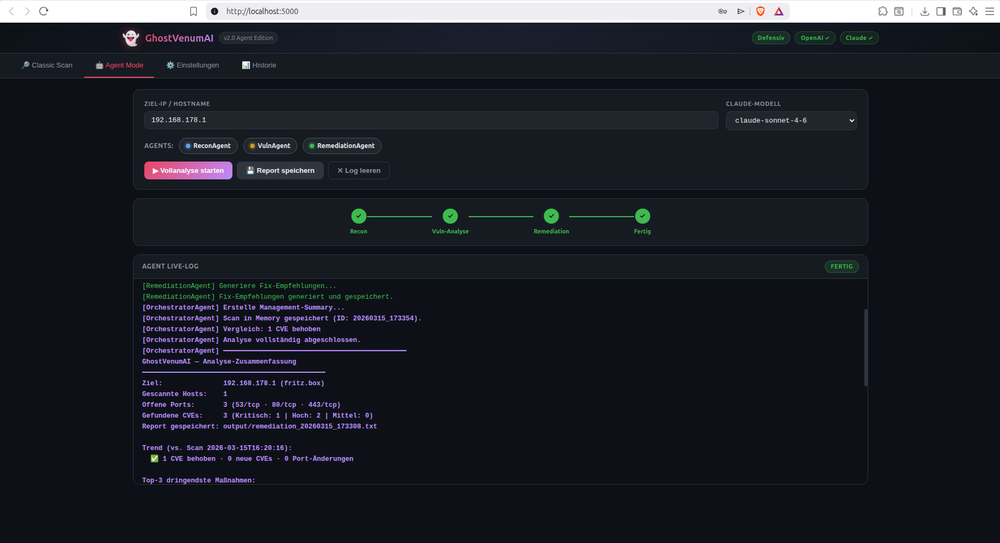
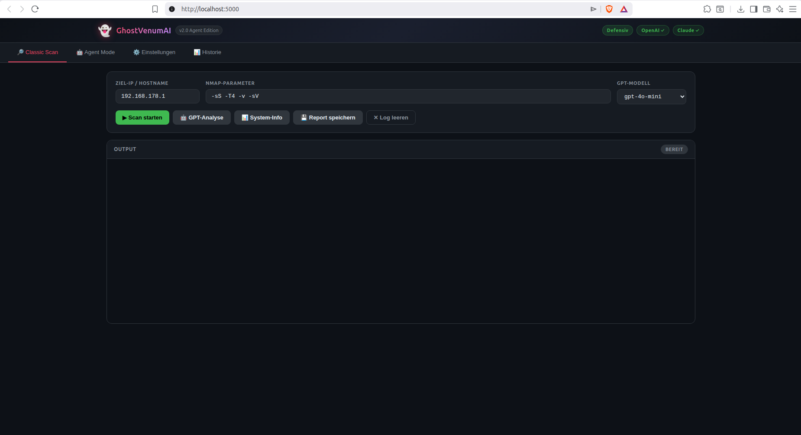
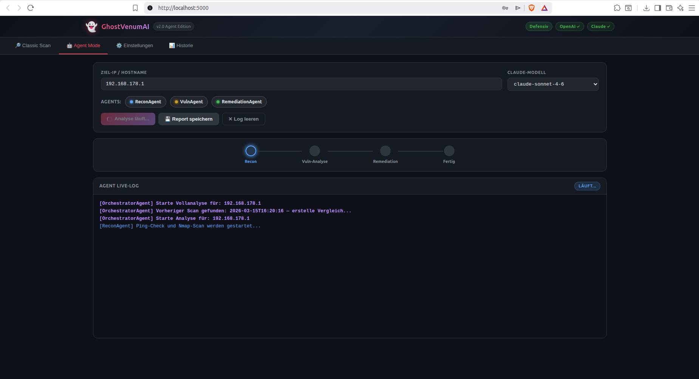
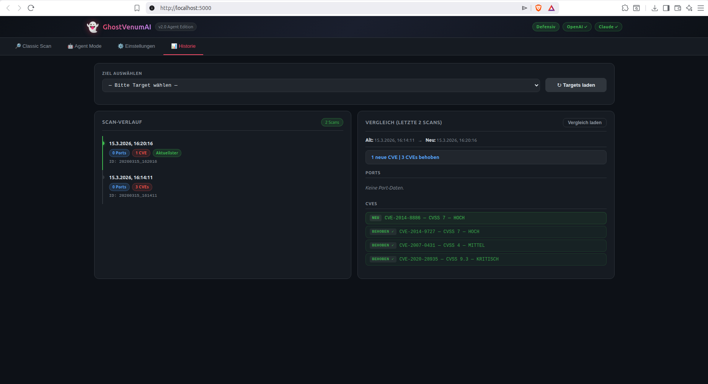

# 👻 GhostVenumAI — Final Edition

<div align="center">



[](https://python.org)
[](https://anthropic.com)
[](https://flask.palletsprojects.com)
[](https://www.iso.org/isoiec-27001-information-security.html)
[](https://dsgvo-gesetz.de)
[](LICENSE)

**Defensive AI-powered network analysis platform with autonomous agents, enterprise compliance and encrypted vault.**

[Features](#features) · [Architecture](#architecture) · [Quick Start](#quick-start) · [Agent Workflow](#agent-workflow) · [Enterprise](#enterprise-features) · [Screenshots](#screenshots)

</div>

---

## What is GhostVenumAI?

GhostVenumAI is a **defensive network security platform** that combines Nmap scanning with autonomous AI agents powered by **Claude (Anthropic)**. It runs fully locally, has a modern web GUI, a CLI, and a complete enterprise security stack.

**Purely defensive** — no exploit code, no brute force, no payloads. Only for systems you own or have explicit written permission to scan.

---

## Screenshots

<table>
<tr>
<td align="center"><b>Classic Scan</b></td>
<td align="center"><b>Agent Mode — Live</b></td>
</tr>
<tr>
<td></td>
<td></td>
</tr>
<tr>
<td align="center"><b>Agent Mode — Complete</b></td>
<td align="center"><b>History — Before/After Diff</b></td>
</tr>
<tr>
<td></td>
<td></td>
</tr>
</table>

---

## Features

### 🤖 4 Autonomous AI Agents (Claude)

| Agent | Role |
|---|---|
| **OrchestratorAgent** | Coordinates the full workflow, generates management summary, memory diff |
| **ReconAgent** | Decides scan strategy automatically, executes Nmap with optimal parameters |
| **VulnAgent** | Parses discovered services, queries NVD CVE database (free, no key required) |
| **RemediationAgent** | Generates OS-specific fix commands, saves encrypted remediation report |

### 🧠 Persistent Memory — Before/After Comparison

Every scan is saved as JSON in `output/history/`. On the next scan of the same target, an automatic diff is generated:

| Status | Meaning |
|---|---|
| 🟢 **NEW** | Port or CVE appeared since last scan |
| 🔴 **CLOSED** | Port was closed (patch applied or service stopped) |
| ✅ **RESOLVED** | CVE no longer found — patch confirmed |
| ⬜ **UNCHANGED** | No change detected |

### 🌐 Modern Web GUI

- Dark theme, responsive layout
- 4 tabs: **Classic Scan / Agent Mode / Settings / History**
- Live streaming agent log via Server-Sent Events (SSE)
- Progress steps: Recon → Vuln-Analysis → Remediation → Done
- Pure HTML/CSS/JS — no Electron, no heavy framework

### 🔎 Classic Scan Mode

- Manual Nmap parameter control
- Optional GPT analysis via OpenAI
- Save reports as `.txt`

### 🔐 Enterprise Security Stack

| Module | Standard |
|---|---|
| **RBAC** — Role-Based Access Control | ISO 27001 A.9 |
| **TOTP MFA** — Two-factor authentication | BSI M 4.133 |
| **Argon2id** password hashing | OWASP 2024, NIST SP 800-63b |
| **HMAC Audit Log** — tamper-proof chain | ISO 27001 A.12.4 |
| **AES-256-GCM Key Vault** — encrypted API keys | ISO 27001 A.10 |
| **DSGVO Compliance** — Art. 17, 20, 30, 33, 35 | DSGVO / GDPR |
| **Incident Manager** — 72h reporting timer | DSGVO Art. 33 |
| **Security Headers** — HSTS, CSP, X-Frame | BSI APP.3.1 |
| **Automated Backup** — 3-2-1 rule | ISO 27001 A.17.1 |
| **24/7 Monitor** — continuous scanning | BSI SYS.1.1 |
| **Compliance API** — REST endpoints | ISO 27001, BSI |
| **PDF Reports** — encrypted, professional | BSI CON.1 |

---

## Architecture

```
ghostvenumaiagentsfinal/
├── app.py                          # Flask backend + SSE streaming
├── main.py                         # Entry point (GUI + CLI)
├── cli.py                          # Full CLI interface
├── gui.py                          # Desktop GUI (Tkinter)
├── agent_tab.py                    # Agent Mode GUI tab
├── monitor_tab.py                  # Monitor GUI tab
├── requirements.txt
├── config.example.json             # Config template (copy → config.json)
├── nginx_ghostvenum.conf           # Nginx reverse proxy config
├── setup_https.sh                  # Let's Encrypt / HTTPS setup
├── backup_nightly.sh               # Automated nightly backup script
│
├── templates/
│   ├── index.html                  # Web GUI
│   └── compliance.html             # Compliance dashboard
│
├── static/
│   ├── css/style.css               # Dark theme
│   └── js/app.js                   # Frontend JavaScript
│
└── modules/
    ├── scanner.py                  # Nmap execution (-sS → -sT fallback)
    ├── gpt_analysis.py             # OpenAI GPT analysis (Classic mode)
    ├── report.py                   # Text report generator
    ├── system_info.py              # Hostname, IP, MAC, platform detection
    ├── auth.py                     # PBKDF2-HMAC-SHA256 authentication
    ├── memory.py                   # Persistent scan history + diff engine
    ├── i18n_quick.py               # Internationalization: DE / EN / ES
    │
    ├── ── Enterprise Modules ──
    ├── rbac.py                     # Role-Based Access Control + TOTP MFA
    ├── audit_logger.py             # HMAC-chained tamper-proof audit log
    ├── key_manager.py              # AES-256-GCM encrypted API key vault
    ├── security_headers.py         # HTTP security headers + CORS
    ├── compliance_api.py           # REST API: ISO 27001, DSGVO, BSI
    ├── dsgvo.py                    # GDPR compliance manager
    ├── incident_manager.py         # Security incident + 72h DSGVO timer
    ├── privacy_filter.py           # PII detection & anonymization
    ├── report_crypto.py            # Encrypted PDF report generation
    ├── report_generator.py         # Professional PDF report builder
    ├── monitor.py                  # 24/7 network monitoring engine
    ├── backup.py                   # Automated local backup (3-2-1 rule)
    ├── alerting.py                 # Alert system (email, webhook)
    │
    └── agents/
        ├── orchestrator.py         # Coordinates all agents + memory diff
        ├── recon_agent.py          # Claude + Nmap tools
        ├── vuln_agent.py           # Claude + NVD CVE API
        ├── remediation_agent.py    # Claude + fix generator + report save
        └── run_agents.py           # Agent workflow entry point
```

---

## Quick Start

### Requirements

- **Python 3.10+**
- **Nmap** — `sudo apt install nmap`
- **Anthropic API key** — for Agent Mode ([get one here](https://console.anthropic.com))
- **OpenAI API key** — optional, for Classic GPT analysis

### Install

```bash
git clone https://github.com/ghostvenumai/ghostvenumaiagentsfinal.git
cd ghostvenumaiagentsfinal

pip install -r requirements.txt

cp config.example.json config.json
# Edit config.json and add your API keys
```

### Run — Web GUI

```bash
python3 main.py
# Opens browser at http://localhost:5000
```

### Run — CLI Agent Mode

```bash
python3 main.py --agents --target 192.168.178.1
# or
python3 cli.py --target 192.168.178.1 --mode agent
```

### Run with HTTPS (Production)

```bash
# Setup nginx + Let's Encrypt
sudo ./setup_https.sh

# Use provided nginx config
sudo cp nginx_ghostvenum.conf /etc/nginx/sites-available/ghostvenum
sudo nginx -t && sudo systemctl reload nginx
```

---

## Agent Workflow

```
User: "Analyze 192.168.178.1"
  │
  ▼
OrchestratorAgent
  ├─ Checks memory → previous scans of this target?
  ├─ Handoff → ReconAgent
  │    ├─ ping_check(target)
  │    └─ nmap_scan(target, args)  ←  automatically decides strategy
  ├─ Handoff → VulnAgent
  │    ├─ parse_services_from_scan(output)
  │    └─ lookup_cve(service, version)  ←  NVD API (free, no key needed)
  ├─ Handoff → RemediationAgent
  │    ├─ generate_fix_commands(service, os_type)
  │    └─ save_remediation_report(content)  →  output/remediation_*.txt
  ├─ Saves scan to memory  →  output/history/<target>_<timestamp>.json
  ├─ Generates diff vs. previous scan
  └─ Management Summary:
       "3 hosts found | 2 critical CVEs | Top action: update OpenSSH"
```

### Memory Format

```json
{
  "scan_id": "20260315_153000",
  "target": "192.168.178.1",
  "timestamp": "2026-03-15T15:30:00",
  "ports": [
    {"port": 22, "proto": "tcp", "service": "ssh", "version": "OpenSSH 8.9p1"}
  ],
  "cves": [
    {"cve_id": "CVE-2023-38408", "cvss": 9.8, "severity": "CRITICAL"}
  ],
  "raw_scan": "...",
  "raw_cves": "...",
  "summary": "..."
}
```

---

## Enterprise Features

### RBAC + TOTP MFA

```python
# Roles: admin, analyst, viewer
# MFA: TOTP (RFC 6238) via pyotp
# Password hashing: Argon2id (quantum-resistant, OWASP 2024)
```

### Encrypted API Key Vault

API keys are never stored in plaintext. The vault uses AES-256-GCM with PBKDF2-HMAC-SHA256 (600,000 iterations, NIST 2024):

```bash
# Keys are stored in config.vault (encrypted)
# Master password is required to unlock at runtime
```

### HMAC Audit Log

Every action is logged with a tamper-proof HMAC chain — any manipulation of past entries is detected on verification:

```
logs/audit.jsonl  ←  HMAC(prev_hash || entry_json)
```

### DSGVO / GDPR Compliance

| Article | Implementation |
|---|---|
| Art. 17 | Right to erasure — automated data deletion |
| Art. 20 | Data portability — JSON/CSV export |
| Art. 30 | Processing records — auto-generated register |
| Art. 33 | 72h breach notification timer |
| Art. 35 | Data protection impact assessment (DPIA) |

### 24/7 Network Monitor

Continuous background scanning with configurable intervals. Alerts via email or webhook on:
- New open ports detected
- New CVEs found
- Service changes

---

## Configuration

```json
{
  "anthropic_api_key": "sk-ant-...",
  "openai_api_key":    "sk-...",
  "language":          "de",
  "web_host":          "0.0.0.0",
  "web_port":          5000,
  "default_target":    "",
  "scan_intensity":    "normal"
}
```

### API Keys

| Key | Used for | How to get |
|---|---|---|
| `anthropic_api_key` | Agent Mode (all 4 agents) | [console.anthropic.com](https://console.anthropic.com) |
| `openai_api_key` | Classic GPT analysis | [platform.openai.com](https://platform.openai.com) |

Priority: **environment variable > config.json > encrypted vault**

```bash
export ANTHROPIC_API_KEY="sk-ant-..."
export OPENAI_API_KEY="sk-..."
```

---

## Compliance

GhostVenumAI is designed and documented against the following standards:

| Standard | Coverage |
|---|---|
| **ISO/IEC 27001:2022** | A.8, A.9, A.10, A.12, A.16, A.17 |
| **BSI IT-Grundschutz** | APP.3.1, CON.1, DER.2, OPS.1.1.5, ORP.4, SYS.1.1 |
| **DSGVO / GDPR** | Art. 5, 17, 20, 30, 33, 34, 35 |
| **NIST SP 800-63b** | Password & authentication requirements |
| **OWASP ASVS 2024** | Application security verification |

---

## Ethical Usage

This tool is designed for **defensive security analysis only**:

- Only scan systems you **own** or have **explicit written permission** to scan
- No exploit generation, no payload creation, no brute force
- CVE lookup is informational only — no automated exploitation
- Compliant with German BSI guidelines for security tooling

---

## Tech Stack

| Layer | Technology |
|---|---|
| AI Agents | Claude (Anthropic) via `anthropic` SDK |
| Web Backend | Flask 3.0 + Flask-CORS |
| Frontend | HTML5, CSS3, vanilla JavaScript |
| Streaming | Server-Sent Events (SSE) |
| PDF Reports | ReportLab |
| Cryptography | PyCryptodome, `cryptography` library |
| Password Hashing | Argon2id (`argon2-cffi`) |
| MFA | TOTP via `pyotp` |
| Network Scanning | Nmap (subprocess) |
| CVE Database | NIST NVD API (free) |

---

## Built by

**Serkan Iazurlo** — [github.com/ghostvenumai](https://github.com/ghostvenumai)

*GhostVenumAI Final Edition — March 2026*

---

<div align="center">
<sub>Defensive security only. Scan only what you own or have permission to scan.</sub>
</div>
